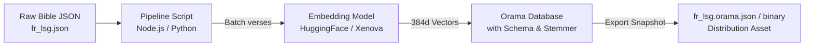

# Pre-computing Verse Embeddings for Client-Side Semantic Search

This guide details the complete architecture, pipeline, and code required to pre-compute vector embeddings for Bible verses at build-time and export them as an **Orama database snapshot**.

---

## 1. Why Pre-compute Embeddings?

A full Bible translation contains **31,102 verses**. 

* **If computed on the client on-demand:** Generating 31,102 embeddings in the browser would take **5–15 minutes** and drain battery/memory.
* **By pre-computing at build-time (Offline):** The developer generates all 31,102 vectors **once** using GPU/CPU scripts and packages them with the text into an Orama index snapshot file (`~35–45 MB`, compressible to `~15–20 MB` with gzip/brotli).
* **Client experience:** The user downloads the pre-built snapshot once. When they search, the client only needs to embed the **single search query string** (~20 ms) and compare it against the pre-computed database.

---

## 2. Choosing the Right Embedding Model

Because the Bible collection includes multiple languages (English like `en_kjv`, French like `fr_lsg`), the embedding model must balance **multilingual semantic accuracy**, **vector dimension**, and **client runtime size**:

| Model | Dimensions | Multilingual Support | Quantized Size (Client) | Best For |
| :--- | :--- | :--- | :--- | :--- |
| **`paraphrase-multilingual-MiniLM-L12-v2`** | 384 | 50+ languages (FR, EN, ES, DE) | ~45 MB | **Recommended for multi-language Bible** |
| **`bge-small-en-v1.5`** | 384 | English only | ~22 MB | Best accuracy/speed for English-only |
| **`all-MiniLM-L6-v2`** | 384 | English (moderate French) | ~23 MB | Ultra-fast lightweight option |

---

## 3. The Build-Time Pipeline Architecture



---

## 4. Implementation: Node.js / TypeScript Pre-computation Script

Below is a complete script using `@xenova/transformers` (or `@huggingface/transformers`) and `@orama/orama` to generate the snapshot.

### Step 1: Install Build Dependencies
```bash
pnpm add -D @xenova/transformers @orama/orama @orama/plugin-data-persistence @orama/stemmers
```

### Step 2: Build Script (`scripts/generate-bible-index.ts`)

```typescript
import fs from 'node:fs/promises';
import path from 'node:path';
import { pipeline } from '@xenova/transformers';
import { create, insertMultiple } from '@orama/orama';
import { persistToFile } from '@orama/plugin-data-persistence/server';
import { stemmer as frenchStemmer } from '@orama/stemmers/french';
import { stemmer as englishStemmer } from '@orama/stemmers/english';

interface RawBibleJSON {
  version_id: string;
  version_name: string;
  language: string;
  testaments: {
    [testament: string]: {
      [book: string]: {
        [chapter: string]: string[];
      };
    };
  };
}

interface VerseDocument {
  id: string;
  version_id: string;
  testament: string;
  book: string;
  chapter: number;
  verse: number;
  text: string;
  embedding: number[];
}

async function generateBibleIndex(jsonFilePath: string, outputDir: string) {
  console.log(`[1/5] Loading JSON file: ${jsonFilePath}`);
  const rawData: RawBibleJSON = JSON.parse(await fs.readFile(jsonFilePath, 'utf-8'));
  const isFrench = rawData.language.toLowerCase().includes('french');

  console.log(`[2/5] Initializing embedding pipeline...`);
  // Load multilingual feature extraction pipeline (runs on CPU/GPU via ONNX)
  const embedder = await pipeline('feature-extraction', 'Xenova/paraphrase-multilingual-MiniLM-L12-v2', {
    quantized: true,
  });

  console.log(`[3/5] Extracting flat verses list...`);
  const flatVerses: Omit<VerseDocument, 'embedding'>[] = [];

  for (const [testament, books] of Object.entries(rawData.testaments)) {
    for (const [book, chapters] of Object.entries(books)) {
      for (const [chapterStr, verses] of Object.entries(chapters)) {
        const chapter = parseInt(chapterStr, 10);
        verses.forEach((text, index) => {
          const verse = index + 1;
          flatVerses.push({
            id: `${rawData.version_id}_${book}_${chapter}_${verse}`,
            version_id: rawData.version_id,
            testament,
            book,
            chapter,
            verse,
            text,
          });
        });
      }
    }
  }

  console.log(`Extracted ${flatVerses.length} verses.`);

  console.log(`[4/5] Generating embeddings in batches...`);
  const batchSize = 64;
  const documentsWithEmbeddings: VerseDocument[] = [];

  for (let i = 0; i < flatVerses.length; i += batchSize) {
    const batch = flatVerses.slice(i, i + batchSize);
    const texts = batch.map((v) => `${v.book} ${v.chapter}:${v.verse} - ${v.text}`);

    // Generate normalized embeddings
    const output = await embedder(texts, { pooling: 'mean', normalize: true });
    const embeddingsArray: number[][] = output.tolist();

    for (let j = 0; j < batch.length; j++) {
      documentsWithEmbeddings.push({
        ...batch[j],
        embedding: embeddingsArray[j],
      });
    }

    if ((i + batchSize) % 2048 === 0 || i + batchSize >= flatVerses.length) {
      console.log(`Embedded ${Math.min(i + batchSize, flatVerses.length)} / ${flatVerses.length} verses`);
    }
  }

  console.log(`[5/5] Creating and populating Orama index...`);
  const db = await create({
    schema: {
      id: 'string',
      version_id: 'string',
      testament: 'string',
      book: 'string',
      chapter: 'number',
      verse: 'number',
      text: 'string',
      embedding: 'vector[384]',
    },
    components: {
      tokenizer: {
        stemmer: isFrench ? frenchStemmer : englishStemmer,
      },
    },
  });

  await insertMultiple(db, documentsWithEmbeddings);

  await fs.mkdir(outputDir, { recursive: true });
  const outputFile = path.join(outputDir, `${rawData.version_id}.orama.json`);
  
  console.log(`Exporting Orama persistence snapshot to ${outputFile}...`);
  await persistToFile(db, 'json', outputFile);

  console.log(` Done! ${rawData.version_id} index is ready.`);
}

// Example invocation for French Louis Segond:
// generateBibleIndex('.agents/data/json/fr_lsg.json', 'public/indexes');
